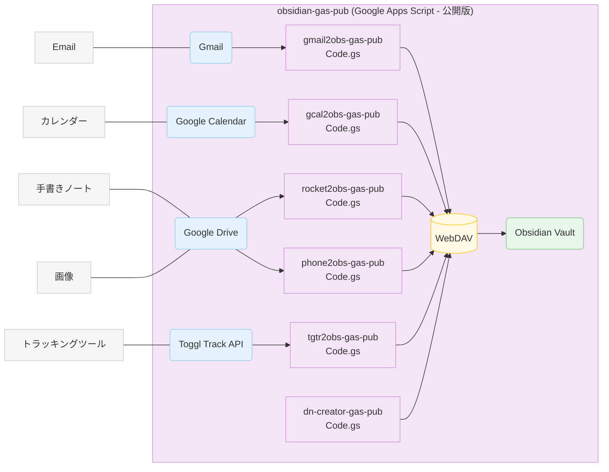
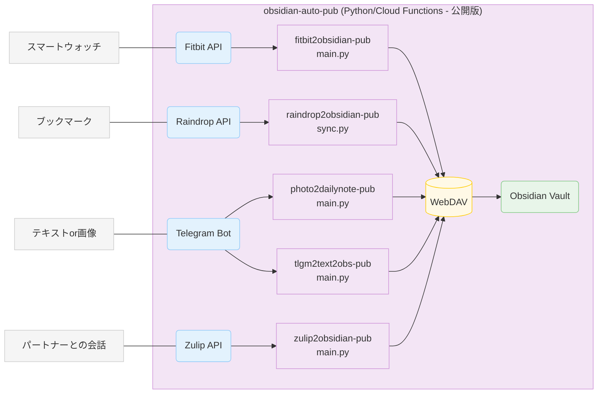
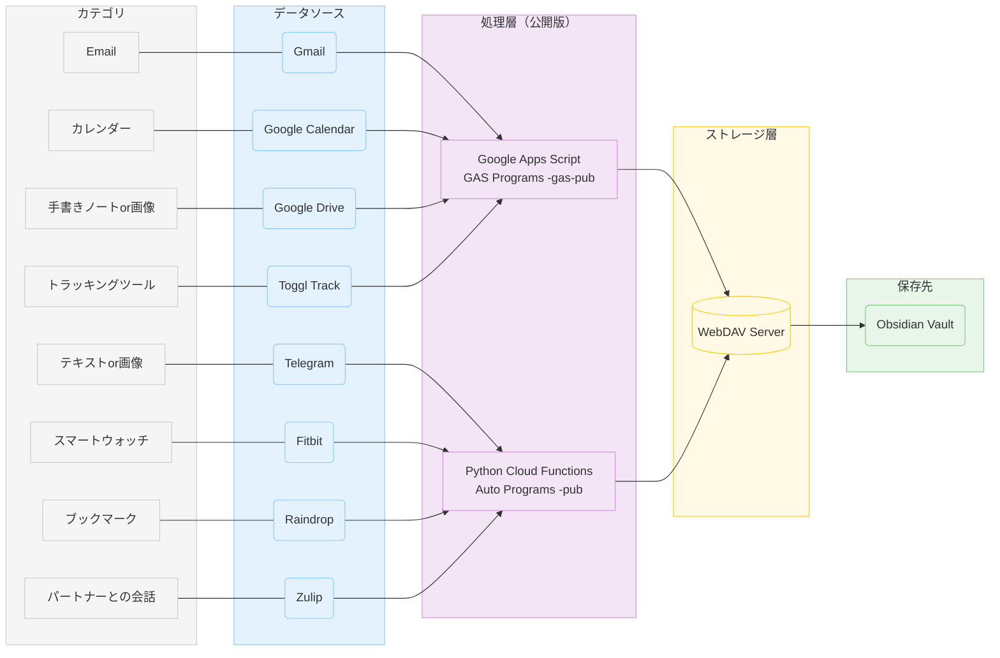

---
Category:
  - 開発｜Development
Date: 2025-11-05
Published: "true"
Slug: ""
created: 2025-11-05 01:17:00+00:00
title: 📘💻️Obsidian × 自動化の実践録：日々の情報が勝手にたまる仕組み【公開リポジトリ付き】
updated: 2025-11-05 01:17:00+00:00
---
AIでプログラミングするのが楽しくなって、その後Notionからobsidianにしたので、
「じゃぁobsidianを気持ちよく使えるように、いっぱいツール作っちゃうぞ！」
ということで、色んなツールを作ってみた。

ようやく一段落したので、整理して、コードも公開してみることにした。
コードオープンデビュー。

## 13の仕組み導入後イメージ

![[Obsidian-×-自動化の実践録：日々の情報が勝手にたまる仕組み【公開リポジトリ付き】_1.avif]]
デイリーノートはこんな感じ。
何に使うの？ってデータもたくさんあるが、溜まっていってるのがなんとなく嬉しくて満足している。笑

## obsidian-gas-pub (Google Apps Script - 公開版)

  

## obsidian-auto-pub (Python/Cloud Functions - 公開版)

  

## 統合フロー図（公開版）

### obsidian-gas-pub (Google Apps Script - 公開版)

| プログラム名 | データソース | 保存方法 | 保存先 | GitHubリポジトリ |
|------------|------------|---------|--------|----------------|
| `gmail2obs-gas-pub` | Gmail | WebDAV | Obsidian Vault | [okkyok-public/gmail2obs-gas-pub](https://github.com/okkyok-public/gmail2obs-gas-pub) |
| `gcal2obs-gas-pub` | Google Calendar | WebDAV | Daily Note | [okkyok-public/gcal2obs-gas-pub](https://github.com/okkyok-public/gcal2obs-gas-pub) |
| `rocket2obs-gas-pub` | Google Drive (RocketBook) | WebDAV | RocketBook フォルダ + Daily Note | [okkyok-public/rocket2obs-gas-pub](https://github.com/okkyok-public/rocket2obs-gas-pub) |
| `phone2obs-gas-pub` | Google Drive (Phone OCR) | WebDAV | Obsidian Vault | [okkyok-public/phone2obs-gas-pub](https://github.com/okkyok-public/phone2obs-gas-pub) |
| `tgtr2obs-gas-pub` | Toggl Track API | WebDAV | Daily Note | [okkyok-public/tgtr2obs-gas-pub](https://github.com/okkyok-public/tgtr2obs-gas-pub) |
| `dn-creator-gas-pub` | デイリーノート自動更新 | WebDAV | Daily Note | [okkyok-public/dn-creator-gas-pub](https://github.com/okkyok-public/dn-creator-gas-pub) |

### obsidian-auto-pub (Python/Cloud Functions - 公開版)

| プログラム名                  | データソース                  | 保存方法   | 保存先            | GitHubリポジトリ                                                                                   |
| ----------------------- | ----------------------- | ------ | -------------- | --------------------------------------------------------------------------------------------- |
| `fitbit2obsidian-pub`   | Fitbit API              | WebDAV | Daily Note     | [okkyok-public/fitbit2obsidian-pub](https://github.com/okkyok-public/fitbit2obsidian-pub)     |
| `raindrop2obsidian-pub` | Raindrop API            | WebDAV | Daily Note     | [okkyok-public/raindrop2obsidian-pub](https://github.com/okkyok-public/raindrop2obsidian-pub) |
| `photo2dailynote-pub`   | Telegram Bot (画像orテキスト) | WebDAV | Daily Note     | [okkyok-public/photo2dailynote-pub](https://github.com/okkyok-public/photo2dailynote-pub)     |
| `tlgm2text2obs-pub`     | Telegram Bot (テキスト)     | WebDAV | Obsidian Vault | [okkyok-public/tlgm2text2obs-pub](https://github.com/okkyok-public/tlgm2text2obs-pub)         |
| `zulip2obsidian-pub`    | Zulip API               | WebDAV | Daily Note     | [okkyok-public/zulip2obsidian-pub](https://github.com/okkyok-public/zulip2obsidian-pub)       |

### 補足プログラム

| プログラム名 | 説明 | GitHubリポジトリ |
|------------|------|----------------|
| `fitbit2tgtr-pub` | Fitbit → Toggl Track (Obsidianには直接書き込まない) | [okkyok-public/fitbit2tgtr-pub](https://github.com/okkyok-public/fitbit2tgtr-pub) |

### システム管理プログラム

| プログラム名                         | 説明                                                              | GitHubリポジトリ                                                                                                 |
| ------------------------------ | --------------------------------------------------------------- | ----------------------------------------------------------------------------------------------------------- |
| `secret-manager-optimizer-pub` | Secret ManagerをはじめとしたGoogle Cloud functionの使用を最適化し、コストを削減するシステム | [okkyok-public/secret-manager-optimizer-pub](https://github.com/okkyok-public/secret-manager-optimizer-pub) |

コード編集→Google Cloud Function にデプロイ→コード編集→...続けていると、気づいたら、過去の不要なバージョンのものを保存されており、効率よく不要なものを削除するために作成したプログラム。

## 保存方法の詳細

### WebDAV経由
- ほとんどのプログラムがWebDAV経由でObsidian Vaultに直接ファイルを書き込みます
- WebDAV URL、ユーザー名、パスワードで認証
- PUT メソッドでMarkdownファイルをアップロード
- 公開版では、環境変数や`env.example`ファイルで設定を管理

## 公開版の特徴

### セキュリティ対策
- すべての機密情報（APIキー、トークン、パスワードなど）は環境変数または`env.example`で管理
- 実際のサーバーURLやプロジェクトIDはexample値に置き換え
- `.gitignore`で機密ファイルを除外

### 環境変数管理
- 各プロジェクトに`env.example`ファイルが含まれています
- 実際の設定値は`.env`ファイルで管理（Git管理対象外）
- 公開用の設定例が`env.example`に記載されています

### デプロイ方法
- **GAS版**: Google Apps Scriptのエディタで直接コピー&ペースト
- **Python版**: Google Cloud Functionsにデプロイ（`deploy.sh`スクリプトを使用）

## 注意事項

- `fitbit2tgtr-pub`はObsidianには直接書き込みません（Toggl Trackにデータを送信するのみ）
- 一部のプログラムは複数のWebDAVサーバーに対応（複数のObsidian Vaultに同時保存可能）
- デイリーノートへの追加は、既存のファイルを読み込んで更新する形式
- すべてのプログラムがWebDAV経由でObsidian Vaultに保存します
- 公開版では、実際のシークレット情報は含まれていません。使用前に`env.example`を参考に`.env`ファイルを作成してください
